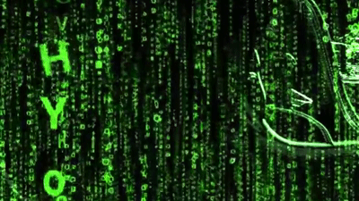

Matrix WebGL filter

Technologies:
- caputuring video frames
- edge detection by shader

Using free video.
https://www.youtube.com/watch?v=TIwokhcM-MU

Refered to:
https://webglfundamentals.org/webgl/lessons/webgl-image-processing.html